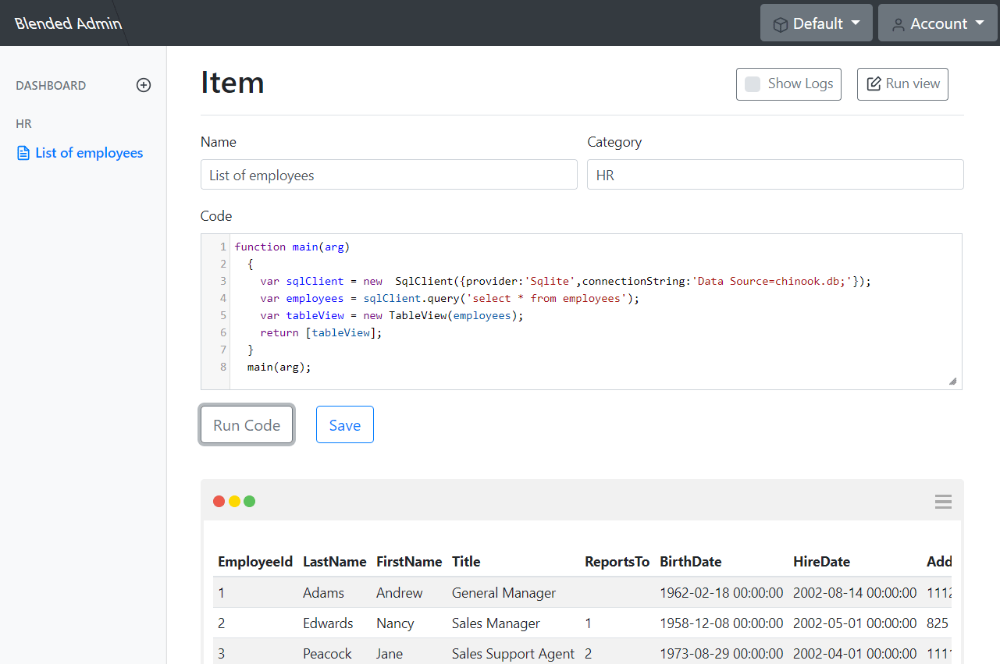
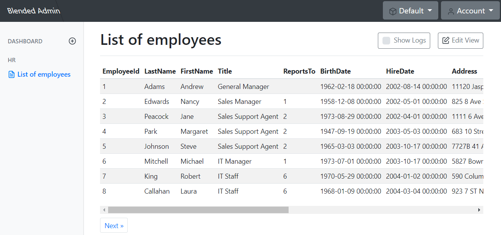
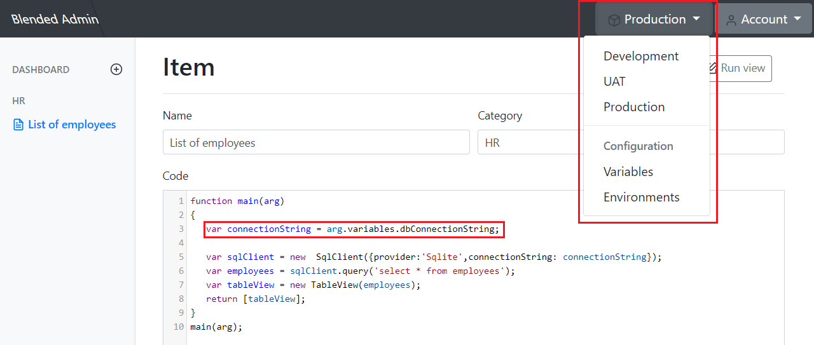

# BlendedAdmin

WebSite: http://blendedadmin.com

Documentation: http://blendedadmin.com/doc/Index.html

Register and try online: http://register.blendedadmin.com

Write JavaScript code, that
connects to applications or databases (eg. MySql, MongoDb, RestAPI) 
do actions (eg. get list of products) 
render result (eg. table with products) 

