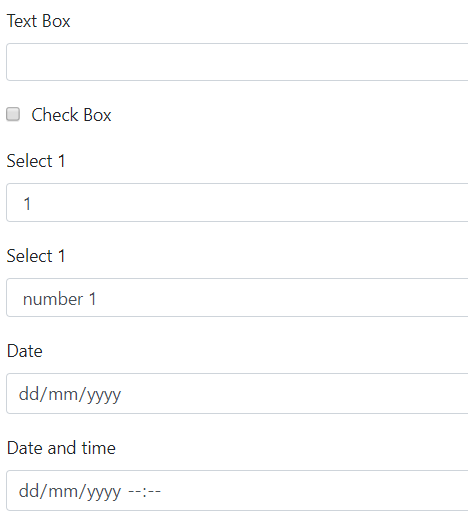
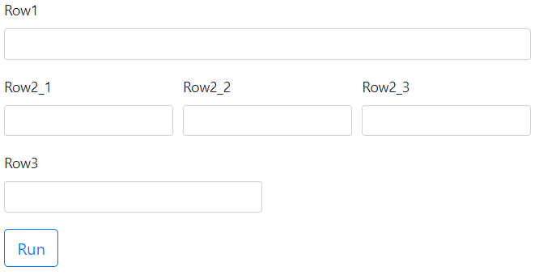
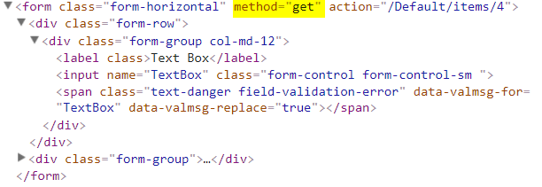
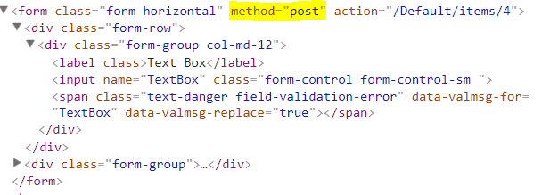

## FormView

### Controls
- List of control
 ```javascript
function main(arg)
{
  	var formView = new FormView({
      	controls: [
          {name:'TextBox', label:'Text Box', type:'input'},
          {name:'CheckBox', label:'Check Box', type:'checkbox'},
          {name:'Select1', label:'Select 1', type:'select', options:[1,2,3]},
          {name:'Select1', label:'Select 1', type:'select', options:[{value:1, text:'number 1'},{value:2, text:'number 2'},{value:3, text:'number 3'}]},
          {name:'Date', label:'Date', type:'date'},
          {name:'DateTime', label:'Date and time', type:'datetime'},
        ]
      });
	return [formView];
}
main(arg);
```

- Layout
Each element of the controls array is a row.
 ```javascript
function main(arg)
{
  	var formView = new FormView({
      	controls: [
          {name:'Row1'},
          [{name:'Row2_1'},{name:'Row2_2'},{name:'Row2_3'}],
	  [{name:'Row3'}, null]
        ]
      });
	return [formView];
}
main(arg);
```


### Method
- Get (by default)
Value of the control is sent to the server in query string and can be accessed via *arg.queryString.{name}*
```javascript
function main(arg)
{
  	var formView = new FormView({
      	  method: 'get',
      	  controls: [{name:'TextBox', label:'Text Box', type:'input', value:arg.queryString.TextBox}]
        });
	return [formView];
}
main(arg);
```


- Post
Value of the control is sent to the server in body and can be accessed via *arg.form.{name}*
 ```javascript
function main(arg)
{
  	var formView = new FormView({
      	  method: 'post',
      	  controls: [{name:'TextBox', label:'Text Box', type:'input', value:arg.form.TextBox}]
        });
	return [formView];
}
main(arg);
```

