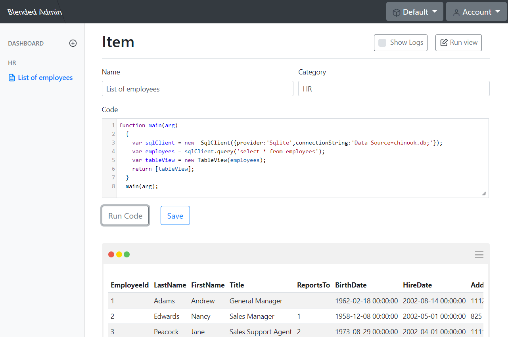

# Getting started

I’m a software developer that likes to work on new applications. Every time I start a new project, I stay focused on implementing an interface for the user. Then I get to the point when I need a control panel for myself, to administrate the application.

I tend to keep SQL queries in Notepad, and then every time I need to check the same thing again, I copy/paste the query and run it in the management tool. I do the same with MongoDB, Rest API and many other back-end systems.

Another issue is environments. Usually I have my local environment, development and production servers. Connecting to the right server and executing the right query can be sometimes frustrating. It’s getting even worse when I’m using multiple databases and APIs in the same project. I don’t want to spent my time on implementing an administration interface. The only thing I need is to save my queries in one place and be able to re-run them whenever I need.

There are many application on the market that allow to create a user interface, but all of them are quite limited. Every time you want to make something non-standard, you waste a lot of time looking for a workaround. This is because they provide a designer where you drag and drop controls and attach data source. It limits the flexibility of making anything different than the creator thought of.

All above, inspired me to create an application that could ease creating an administration panel - Blended Admin. The idea is that you code your admin console using JavaScript.

To give you a glimpse of how it works, see the following example.

The JavaScript code connects to Sqlite database and gets the list of employees. The results are returned as a table. You can test the code by pressing “Run Code” button, and once you are happy with it, just save it.

Now, you can execute it, every time you need it!

