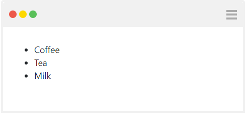
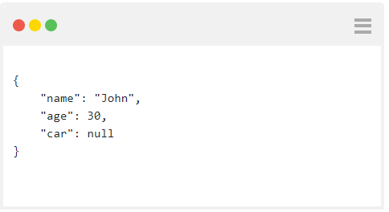

# HtmlView
Use HtmlView to display any html.

## Render simple html
```javascript
function main(arg)
{
   var htmlView = new HtmlView('<div><h1>hello</h1</div>'); 
   return [htmlView];
}
main(arg);
```


## Render complex html
```javascript
function main(arg)
{
   var htmlView = new HtmlView(`
<ul>
  <li>Coffee</li>
  <li>Tea</li>
  <li>Milk</li>
</ul>`); 
  
   return [htmlView];
}
main(arg);
```


## Render json
```javascript
function main(arg)
{
   var person = { "name":"John", "age":30, "car":null };
   var personJson = JSON.stringify(person, null, 4);
   var htmlView = new HtmlView('<pre>' + personJson + '</pre>'); 
   return [htmlView];
}
main(arg);
```


## Render JavaScript
```javascript
function main(arg)
{
   var js = `
<div id="greeting"></div>
<script>
  var greeting = document.getElementById('greeting');
  greeting.innerHTML = 'Hola!';
</script>
`;
   var htmlView = new HtmlView(js); 
   return [htmlView];
}
main(arg);
```

