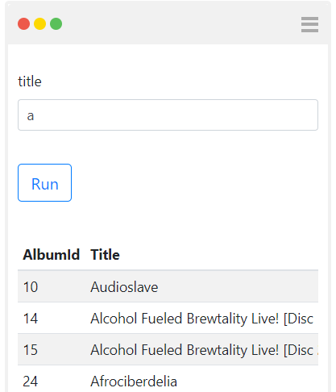

# Sql - List with filter

The following code will display the first 200 albums and allow to filter them by title.
```javascript
function main(arg)
{
  var title = arg.queryString.title ? arg.queryString.title : "";
  
  var formView = new FormView({
    method:'get',
    controls: [[{name:'title', value: title},null]]
  });
  
  var sqlClient = new  SqlClient({provider:'Sqlite',connectionString:'Data Source=chinook.db;'});
  var employees = sqlClient.query(
    `select * from albums where title like @title`,
    {title: title + '%'}
  );
  var tableView = new TableView(employees);
  
  return [formView,tableView];
}
main(arg);
```




To make it more efficient, we can add paging to the list.

```javascript
function main(arg)
{
  var title = arg.queryString.title ? arg.queryString.title : "";
  var page = arg.queryString.p ? parseInt(arg.queryString.p) : 1;
  var pageSize = 20;
  var begin = (page - 1) * pageSize;
  var end = begin + pageSize;
  
  var formView = new FormView({
    method:'get',
    controls: [[{name:'title', value: title},null]]
  });
  
  var sqlClient = new  SqlClient({provider:'Sqlite',connectionString:'Data Source=chinook.db;'});
  var employees = sqlClient.query(
    `select * from albums where title like @title limit ` + end,
    {title: title + '%'}
  ).slice(begin, end);
  var tableView = new TableView(employees);
  
  return [formView,tableView];
}
main(arg);
```
