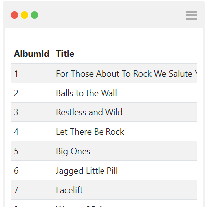

# Sql - Show list of items

```javascript
function main(arg)
{
  var sqlClient = new  SqlClient({provider:'Sqlite',connectionString:'Data Source=chinook.db;'});
  var employees = sqlClient.query('select * from employees');
  var tableView = new TableView(employees);
  return [tableView];
}
main(arg);
```

