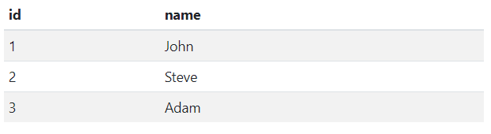
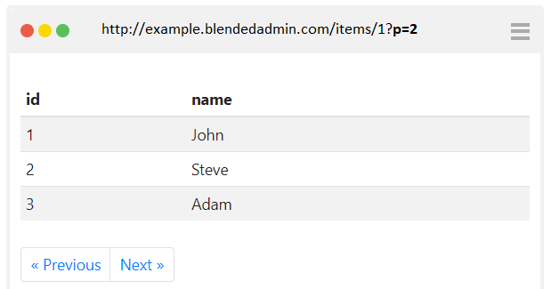

# TableView

## Rows
 ```javascript
function main(arg)
{
  var tableView = new TableView(
    [{id:1, name:'John'},
     {id:2, name:'Steve'},
     {id:3, name:'Adam'}]
  ); 
  return [tableView];
}
main(arg);
```


## Size
By default, the table will show first the 200 rows. It can be controlled by *size* parameter.
 ```javascript
function main(arg)
{
  var tableView = new TableView(
  {
    size: 2,
    rows: [{id:1, name:'John'},
           {id:2, name:'Steve'},
           {id:3, name:'Adam'}]
    }); 
  return [tableView];
}
main(arg);
```

## Paging
By default, the the next page button is always shown. The prevous page button is shown only when the current page is 2 or greater. When the next or previous button is clicked, the get request is sent to server and the **p** query string parameter is added to the url with the page number.
 ```javascript
function main(arg)
{
  var currentPage = arg.queryString.p;
  var tableView = new TableView(
  {
    previoustPage: true,
    nextPage: true,
    rows: [{id:1, name:'John'},
      	   {id:2, name:'Steve'},
           {id:3, name:'Adam'}]
    }); 
  return [tableView];
}
main(arg);
```

